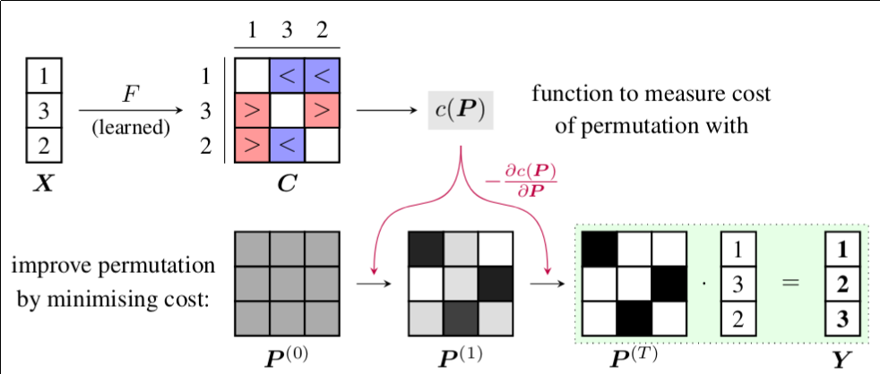

# Learning Representations of Sets through Optimized Permutations



[[poster]][3]

This is the official implementation of our ICLR 2019 paper [Learning Representations of Sets through Optimized Permutations][0] in PyTorch.
In this paper, we propose to encode sets of feature vectors into a single feature vector by learning to permute them, then encoding the permuted set with an RNN.
This avoids the bottleneck where a set of arbitrary size is pooled into a feature vector in a single step, which throws away a lot of information.

The main algorithm is contained in [`permutation.py`][1].
Experiments can be run through the scripts in the `experiments` folder, which calls `train.py` with the appropriate arguments.
The VQA experiment is located in the `ban-vqa` folder, which is a fork of the [ban-vqa][2] source code.

# BibTeX entry
```
@inproceedings{
	zhang2018permoptim,
	title={Learning Representations of Sets through Optimized Permutations},
	author={Yan Zhang and Jonathon Hare and Adam Prügel-Bennett},
	booktitle={International Conference on Learning Representations},
	year={2019},
	url={https://openreview.net/forum?id=HJMCcjAcYX},
}
```


[0]: https://openreview.net/forum?id=HJMCcjAcYX
[1]: https://github.com/Cyanogenoid/perm-optim/blob/master/permutation.py
[2]: https://github.com/jnhwkim/ban-vqa
[3]: https://www.cyanogenoid.com/files/l2p-poster.pdf
